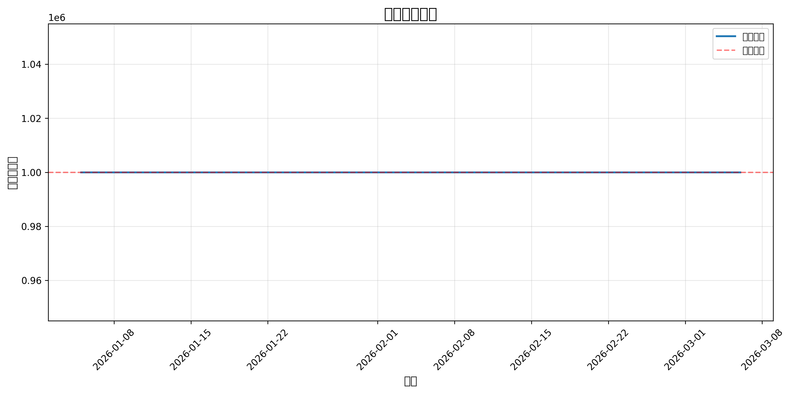

# 量化策略回测报告

**生成时间**: 2026-03-10 01:54:05

---

## 一、策略参数

| 参数 | 值 | 说明 |
|------|-----|------|
| theta_buy | 4.16 | 买入乖离率阈值（%） |
| theta_sell | 18.07 | 卖出乖离率阈值（%） |
| alpha_vol | 0.03 | 缩量系数 |
| rsi_thresh | 32 | RSI阈值 |

---

## 二、回测指标

### 2.1 收益指标

| 指标 | 值 | 目标 | 达标 |
|------|-----|------|------|
| 初始资金 | 1,000,000 元 | - | - |
| 最终权益 | 1,000,000 元 | - | - |
| 总收益率 | 0.00% | - | - |
| 年化收益率 | 0.00% | > 20% | ❌ |

### 2.2 风险指标

| 指标 | 值 | 目标 | 达标 |
|------|-----|------|------|
| 最大回撤 | 0.00% | < 15% | ✅ |
| 夏普比率 | 0.00 | > 1.5 | ❌ |

### 2.3 交易指标

| 指标 | 值 | 目标 | 达标 |
|------|-----|------|------|
| 换手率 | 0.00/月 | < 15%/月 | ✅ |
| 胜率 | 0.00% | > 60% | ❌ |
| 总交易次数 | 0 | - | - |

---

## 三、净值曲线

---

## 四、风险分析

### 4.1 收益风险比

- **Calmar比率**: 0.00
- **收益回撤比**: 0.00

### 4.2 风险提示

- ⚠️ 年化收益率未达标（< 20%）
- ⚠️ 夏普比率未达标（< 1.5）
- ⚠️ 胜率未达标（< 60%）

---

## 五、结论

❌ **策略表现不佳**，需要重新设计策略逻辑。

### 建议

1. 如果年化收益率不达标，考虑放宽买入条件或优化参数
2. 如果最大回撤过大，考虑加强止损逻辑
3. 如果胜率不高，考虑优化买点选择
4. 如果换手率过高，考虑延长持仓周期

---

**报告生成时间**: 2026-03-10 01:54:05
