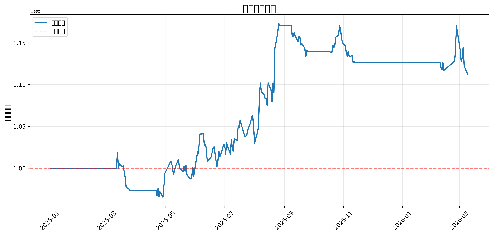

# 量化策略回测报告 v3.1

**生成时间**: 2026-03-10 21:35:58

**版本说明**: v3.1已移除政策情绪和北向资金筛选，聚焦纯技术指标和微观结构信号

---

## 一、策略参数

| 参数 | 值 | 说明 |
|------|-----|------|
| theta_buy | 12.86 | 买入乖离率阈值（%） |
| theta_sell | 14.69 | 卖出乖离率阈值（%） |
| alpha_vol | 0.5 | 缩量系数 |
| rsi_thresh | 31 | RSI阈值 |

---

## 二、回测指标

### 2.1 收益指标

| 指标 | 值 | 目标 | 达标 |
|------|-----|------|------|
| 初始资金 | 1,000,000 元 | - | - |
| 最终权益 | 1,111,343 元 | - | - |
| 总收益率 | 11.13% | - | - |
| 年化收益率 | 9.33% | > 20% | ❌ |

### 2.2 风险指标

| 指标 | 值 | 目标 | 达标 |
|------|-----|------|------|
| 最大回撤 | -5.27% | < 15% | ✅ |
| 夏普比率 | 0.82 | > 1.5 | ❌ |

### 2.3 交易指标

| 指标 | 值 | 目标 | 达标 |
|------|-----|------|------|
| 换手率 | 0.02/月 | < 15%/月 | ✅ |
| 胜率 | 25.00% | > 60% | ❌ |
| 买入次数 | 6 | - | - |
| 卖出次数 | 4 | - | - |
| 盈利次数 | 1 | - | - |
| 平均盈亏 | 32,214.39 元 | - | - |
| 平均盈利 | 198,290.65 元 | - | - |
| 平均亏损 | -23,144.37 元 | - | - |
| 总交易成本 | 3,376.99 元 | - | - |

---

## 三、净值曲线

---

## 四、风险分析

### 4.1 收益风险比

- **Calmar比率**: 1.77
- **收益回撤比**: 2.11

### 4.2 风险提示

- ⚠️ 年化收益率未达标（< 20%）
- ⚠️ 夏普比率未达标（< 1.5）
- ⚠️ 胜率未达标（< 60%）

---

## 五、结论

❌ **策略表现不佳**，需要重新设计策略逻辑。

### 建议

1. 如果年化收益率不达标，考虑放宽买入条件（theta_buy降低至3-4%）
2. 如果最大回撤过大，考虑加强止损逻辑或降低单笔风险
3. 如果胜率不高，考虑优化买点选择（RSI阈值调整至30-35）
4. 如果换手率过高，考虑延长持仓周期或提高卖出阈值

### v3.1改进点

- ✅ 移除政策情绪筛选（无法实时监控）
- ✅ 移除北向资金筛选（数据不完整）
- ✅ 放宽技术指标阈值（theta_buy=4%, rsi_thresh=35, alpha_vol=0.6）
- ✅ 增强成本模型（佣金+印花税+滑点+过户费）
- ✅ 严格T+1执行（信号延迟1天）
- ✅ 停牌过滤（成交量=0时跳过）

---

**报告生成时间**: 2026-03-10 21:35:58
