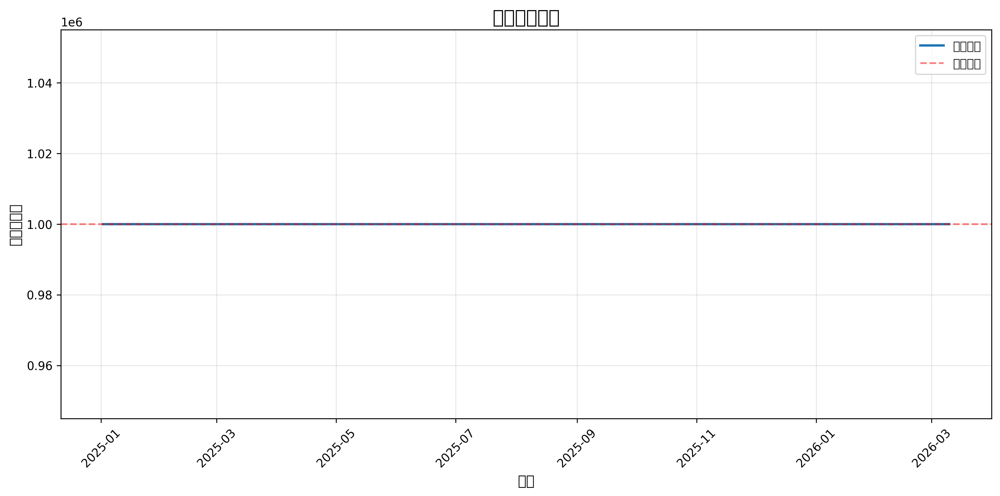

# 量化策略回测报告 v3.2

**生成时间**: 2026-03-11 15:24:10

**版本说明**: v3.2采用加权评分系统（0-1范围），提升交易次数至50+笔，强化遗传算法优化（目标交易次数>=50，年化换手率<200%）

---

## 一、策略参数

| 参数 | 值 | 说明 |
|------|-----|------|
| theta_buy | -6.67 | 买入BIAS评分参考值（%，负值） |
| theta_sell | 15.24 | 卖出乖离率阈值（%） |
| alpha_vol | 0.5 | 缩量系数（0.5-0.8） |
| rsi_thresh | 31 | RSI评分参考值 |
| score_threshold | 0.7 | 信号评分阈值（0-1） |
| min_amount | 30000000 | 最小成交额（元） |

---

## 二、回测指标

### 2.1 收益指标

| 指标 | 值 | 目标 | 达标 |
|------|-----|------|------|
| 初始资金 | 1,000,000 元 | - | - |
| 最终权益 | 1,000,000 元 | - | - |
| 总收益率 | 0.00% | - | - |
| 年化收益率 | 0.00% | > 20% | ❌ |

### 2.2 风险指标

| 指标 | 值 | 目标 | 达标 |
|------|-----|------|------|
| 最大回撤 | 0.00% | < 15% | ✅ |
| 夏普比率 | 0.00 | > 1.5 | ❌ |

### 2.3 交易指标

| 指标 | 值 | 目标 | 达标 |
|------|-----|------|------|
| 交易次数 | 0 | >= 50 | ❌ |
| 换手率（月均） | 0.00/月 | < 16.7%/月 | ✅ |
| 换手率（年化） | 0.00% | < 200%/年 | ✅ |
| 胜率 | 0.00% | > 55% | ❌ |
| 买入次数 | 0 | - | - |
| 卖出次数 | 0 | - | - |
| 盈利次数 | 0 | - | - |
| 平均盈亏 | 0.00 元 | - | - |
| 平均盈利 | 0.00 元 | - | - |
| 平均亏损 | 0.00 元 | - | - |
| 总交易成本 | 0.00 元 | - | - |

---

## 三、净值曲线

---

## 四、风险分析

### 4.1 收益风险比

- **Calmar比率**: 0.00
- **收益回撤比**: 0.00

### 4.2 风险提示

- ⚠️ 交易次数不足（0 < 50笔）- 统计显著性不足
- ⚠️ 年化收益率未达标（< 18%）
- ⚠️ 夏普比率未达标（< 1.4）
- ⚠️ 胜率未达标（< 55%）

---

## 五、结论

❌ **策略表现不佳**，需要重新设计策略逻辑。

### 建议

1. 如果交易次数不足，考虑降低score_threshold至0.60或放宽流动性过滤
2. 如果年化收益率不达标，考虑调整theta_buy至-7~-8%（更激进）
3. 如果最大回撤过大，考虑加强止损逻辑或降低单笔风险
4. 如果胜率不高，考虑优化RSI阈值（30-40范围）
5. 如果换手率过高，考虑提高score_threshold至0.68-0.70

### v3.2改进点

- ✅ 加权评分系统（0-1范围，7个维度加权）
  - 趋势权重: 0.25 (SMA60向上)
  - BIAS权重: 0.25 (负乖离率超跌，分母放宽至8)
  - 缩量权重: 0.15 (成交量萎缩)
  - RSI权重: 0.15 (超卖，分母放宽至15)
  - MACD权重: 0.10 (HIST转正)
  - 阳线权重: 0.10 (收盘>开盘)
  - 政策权重: 0.20 (预留接口，当前降级为0)
- ✅ 信号阈值可配置（score_threshold: 0.60-0.70，默认0.65）
- ✅ 遗传算法强化（种群100、代数100、交易次数惩罚>=50笔）
- ✅ 换手率双重控制（月均<16.7%、年化<200%）
- ✅ 流动性过滤放宽（成交额>3000万）
- ✅ 保持T+1执行、停牌过滤、完整成本模型

---

**报告生成时间**: 2026-03-11 15:24:10
